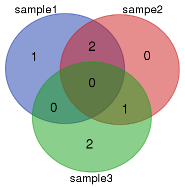

## 问题

有几批数据，理论上来说是一个物种的数据，但是你怀疑这些数据中，有些数据可能被弄混了，有什么方法快速地确定这个问题？

## 想法

1. 对每一批数据，都统计高频k-mer，输出对应的k-mer表。


2. 对每一个k-mer表，都与其他k-mer表进行比对，输出共同、特异k-mer情况。

3. 可以通过k-mer间的差异来观察数据的差别。



## 设计

a. 对每批数据构建高频k-mer表

```
perl Graph.pl pipe -i sampe.lst -k 17 -m 3 -s 1,5 -d sample
```

b.  指定样品与其他样品两两比较，并输出共同或特异的k-mer

```
getKmer -i sample.bit -f other.lst -o sample.log  [-c comm.bit -u uni.bit -a all.bit]

-f: 其他bit的文件列表
-c: 取交集
-u: 取sample.bit特有的
-a: 取并集
```
c. 指定样品，与dna序列比较，输出比对率

```
# 输出所有reads，ID里包含比对情况
kmer2tag -i sample.bit -f fq(a).lst -o kmer.tab -t 8
or 
# 只输出ID和比对情况，不包含序列
kmer2tag -i sample.bit -f fq(a).lst -o /dev/stdout -t 8|grep ">" > kmer.tab 
```

## 省力脚本

a. 批量化高频表生成，并对样品进行两两比较

```
perl KmerBatch.pl [-P og -q dna.q,rna.q,reseq.q -b rice -s 3|5]  sample.info

sample.info:
sample1 read1
sample1 read2
sample2 read3
sample3 read4
```

b. 跟据log文件来对数据进行聚类

```
perl classBit.pl log.lst out_class.txt
```

## 延伸

1. 确定污染源。对将要检查的物种建立高频表(a)，将其比对到nt序列(d)，统计出比对率最高的序列。

2. 区分X，Y染色体。可以测一堆的XX型的个体，把它们混在一起建库测序。建立高频表（a）.接着对XY的个体进行测序，将高频表比对回这个XY数据（c），输出比对率低于20%的序列，对这部分序列进行组装或比对。

3. 基因组比对。先对两个基因组建k-mer表，再对两个表取交集，得到交集（A)。将基因组按照窗口进行切分，比回这个交集A，输出比对率低于30%的区域，这个区域应该就是特征的区域。

## 程序路径：

```
/lustre/project/og03/Public/Git/Denovo_pipe/TheThinker3/Modules/Marker
```

注意事项：

1. 这个目录的Graph.pl程序是连接过来的，直接运行会抱错，请使用KmerBatch.pl脚本来生成频数表。

